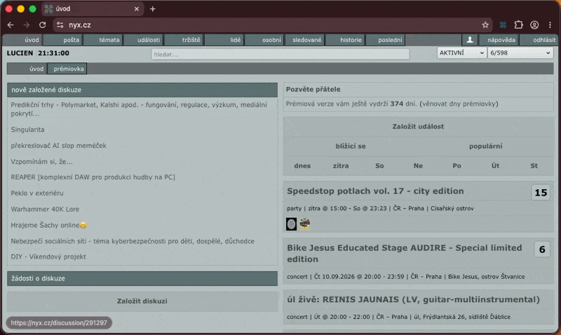
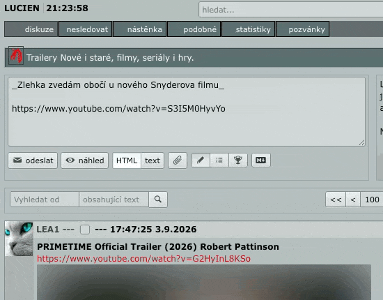
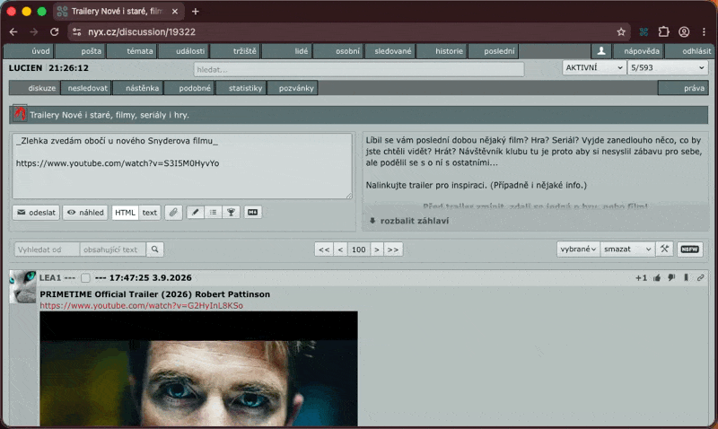

# Fyx pro web

> "Fyx pro web" je rozšíření do Chromium browserů (Chrome, Edge, Brave, ...), které zpříjemňuje čtení a psaní na Nyxu. Žádné sledování, žádný sběr dat, žádné servery: veškeré nastavení zůstává lokálně ve vašem prohlížeči.

---

<p align="center">
🫸 <a href="https://chromewebstore.google.com/detail/fyx-pro-nyxcz/pafhlociccljgiijmbbfblliiomfpdcb?authuser=0&hl=en" target="_blank">Stránka rozšíření na oficiálním Chrome Web Store</a> 🫷 
</p>

---

## Funkce

### NSWF filtr

Stop nevyžádaným 🍌 v poště! Nyní si můžete zapnout NSFW filtr jak v poště tak v diskuzích. Po zapnutí se všechny fotky a videa rozmažou, teprve na klik zobrazí.



### Rychlé odesílání příspěvků

Stačí napsat CMD (Ctrl) + Enter a je odesláno. Případně s Shiftem zobrazíte náhled.



### Podpora Markdownu

Psaní si můžete zpříjemnit zapnutím Markdownu - buď globálně, nebo pro diskuzi/poštu zvlášť.



### Drafty

Už žádné ztracené rozepsané romány - vše co rozepíšete se ukládá jako draft. Jak v poště, tak v jednotlivých diskuzích...

### Notifikace přehledně

Ikona o notifikacích je nově přehledně v horní části obrazovky.

### ...a další

- Zvětšené kontextové menu
- Zvětšená syntaxe kódu v klubech s fontem JetBrains mono
- Globální možnost vypnutí jednotlivých features

## Backlog

- [x] Přepínací menu (globální zapnutí/vypnutí každé feature z popupu v liště)
- [x] Podpora Markdownu
- [x] NSFW filtr (diskuze, pošta)
- [x] Notifikace v menu
- [x] Odeslání přes CMD + Enter
- [x] Zvětšení kontextového menu
- [x] Zvýraznění kódu (JetBrains Mono)
- [ ] Kontextové menu – přidat user ID
- [ ] Fyx téma
- [ ] Dracula téma
- [ ] Přepínač témat
- [ ] Drafty
- [x] ~~Tagy~~

## Vývoj

Postaveno na [WXT](https://wxt.dev) (Manifest V3, Chrome). Vyžaduje **pnpm** a Node ≥ 24.

### Instalace

```sh
pnpm install
```

### Spuštění

```sh
pnpm dev
```

Spustí dev server a sestaví rozšíření do `.output/chrome-mv3-dev/`.
Chrome **neotevře** automaticky – jednou ho načti do svého prohlížeče:

1. Otevři `chrome://extensions`
2. Zapni **Developer mode** (vpravo nahoře)
3. Klikni na **Load unpacked** a vyber složku, kterou vypsal `pnpm dev`:
   `.output/chrome-mv3-dev` (CLI vypíše absolutní cestu při startu)
4. Otevři [nyx.cz](https://www.nyx.cz)

Při každé změně zdrojáků WXT rozšíření přebuildí a automaticky reloadne – není
třeba ho ručně načítat znovu ani refreshovat. Načtení unpacked do tvého běžného
Chrome tě nechá přihlášeného na nyx.cz.

> Dev server na `http://localhost:3000` (nebo `:3001`) vracející 404 je v pořádku –
> je to interní HMR server, ne stránka k návštěvě.

### Ostatní skripty

```sh
pnpm build         # produkční build → .output/chrome-mv3/
pnpm zip           # zabalený .zip pro Chrome Web Store → .output/
pnpm compile       # TypeScript typecheck (tsc --noEmit)
pnpm lint          # ESLint (flat config)
pnpm format:check  # kontrola Prettier (pnpm format pro zápis)
pnpm test          # Vitest (unit testy nad čistou logikou)
```

## Build pro Chrome Web Store

Verze v manifestu se **generuje při buildu** – `wxt.config.ts` ji nastaví jako
`[rok].[den-v-roce].[hodinaminuta]` (UTC), např. `2026.244.830`. Je monotónní
v rámci dne/roku, drží se v limitu Chrome `0–65535` na segment a vždy roste, což
Web Store vyžaduje. `version` v `package.json` se pro rozšíření ignoruje; není co
ručně zvedat.

### Automatický release (běžná cesta)

Každý push do **`master`** spustí GitHub Action `Release`, která:

1. spustí kompletní sadu kontrol (`lint`, `format:check`, `compile`, `test`);
2. spustí `pnpm zip` – orazítkuje manifest aktuálním UTC časem a vytvoří
   store `.zip` v `.output/`;
3. publikuje **GitHub Release**: vytvoří tag `v<version>` na daném commitu,
   přiloží `.zip` a automaticky vygeneruje poznámky ze zmergovaných PR/commitů.

**Nahrání `.zip` do Chrome Web Store je ruční krok** – stáhni ho z GitHub Release
(nebo si ho sestav lokálně) a nahraj v
[Developer Dashboard](https://chrome.google.com/webstore/devconsole). Do store se
nic nepushuje automaticky.

`develop` a pull requesty spouští jen workflow `CI` (stejné kontroly plus
`pnpm build`, bez release).

### Lokální balení (offline / ruční)

```sh
pnpm zip           # → .output/<name>-<version>-chrome.zip, připravený k nahrání
pnpm pack:local    # pnpm zip, pak otaguje HEAD jako v<version> z postaveného
                   #   manifestu (selže při špinavém stromu; tag se nepushuje)
```

Použij jen když potřebuješ store `.zip` bez cesty přes `master` release – např.
jednorázové ruční nahrání. Pro cokoli, co jde do provozu, dej přednost
automatickému release výše.
